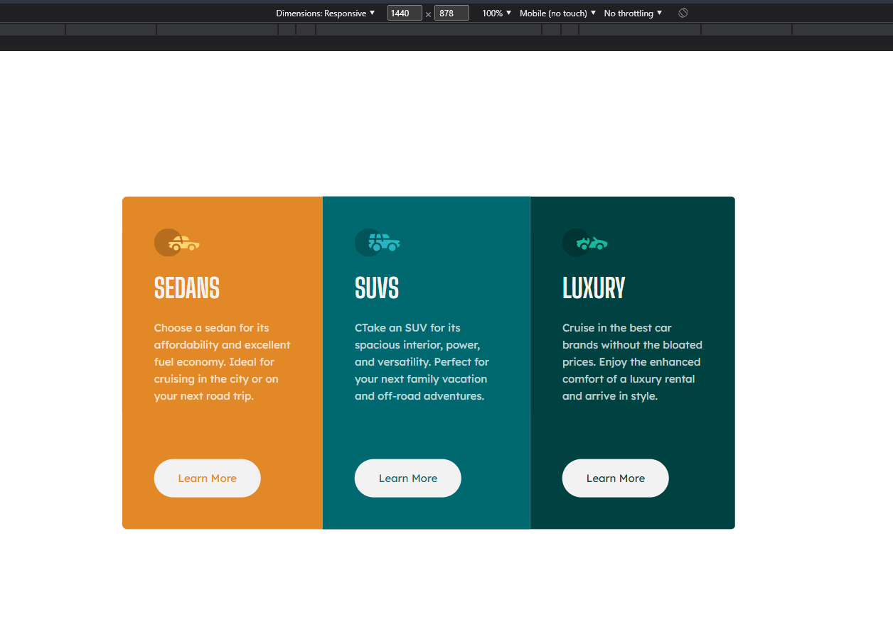
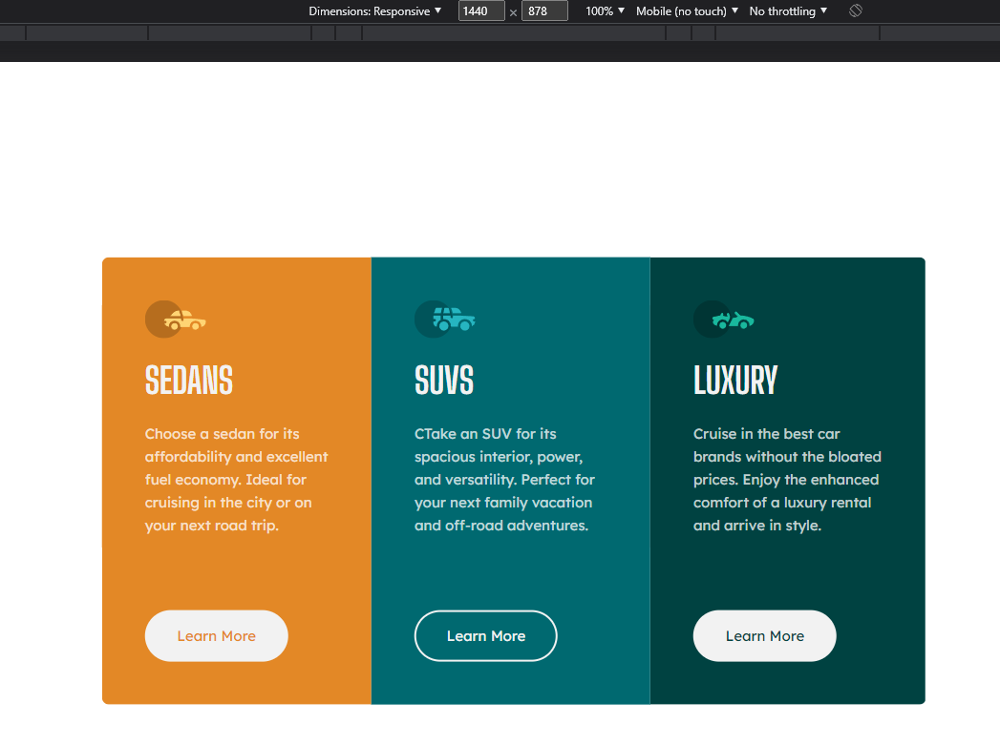
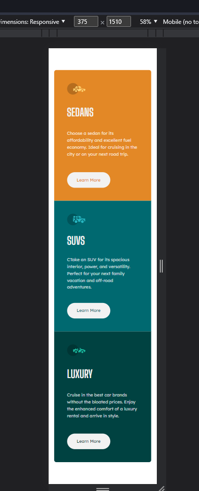
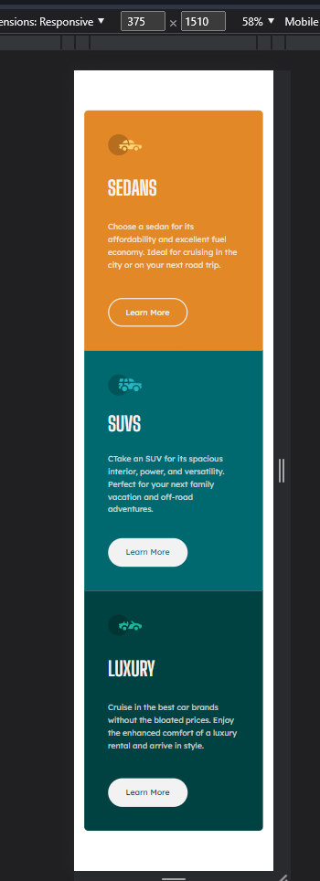

# Frontend Mentor - 3-column preview card component solution

This is a solution to the [3-column preview card component challenge on Frontend Mentor](https://www.frontendmentor.io/challenges/3column-preview-card-component-pH92eAR2-). Frontend Mentor challenges help you improve your coding skills by building realistic projects. 

### The challenge

Users should be able to:

- View the optimal layout depending on their device's screen size
- See hover states for interactive elements

### Screenshot

### Links

- Live Site URL: [Add live site URL here](https://your-live-site-url.com)

### Built with

- HTML5 
- CSS custom properties
- Flexbox

### What I learned

- How to use custom properties in CSS.

## Author

- Frontend Mentor - [@egolam](https://www.frontendmentor.io/profile/egolam)
- Twitter - [@robot4qbu](https://www.twitter.com/robot4qbu)
